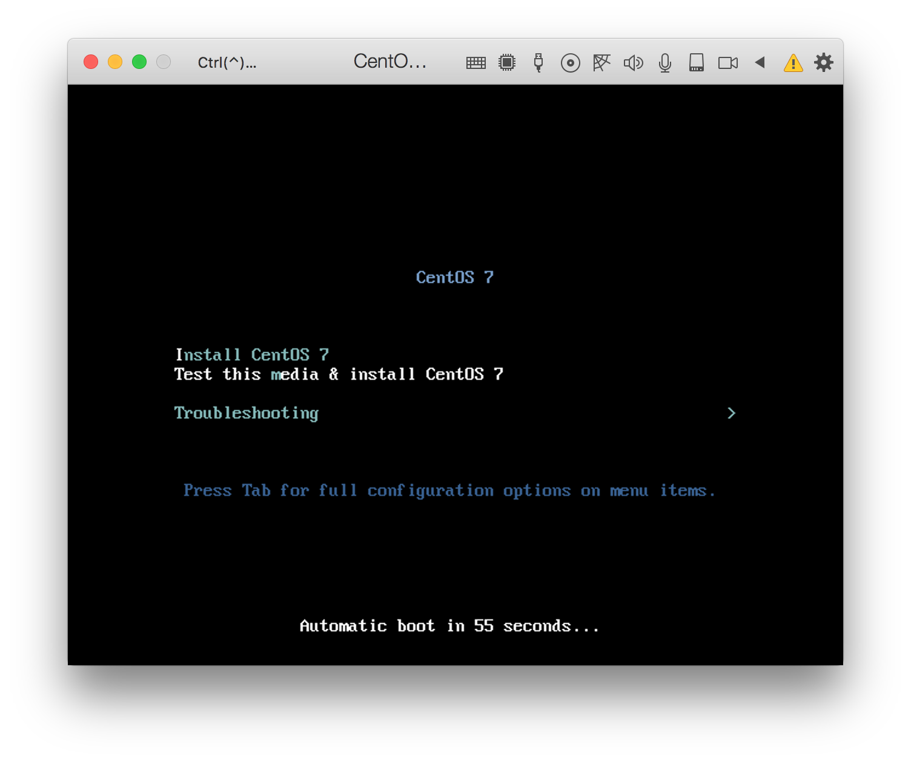
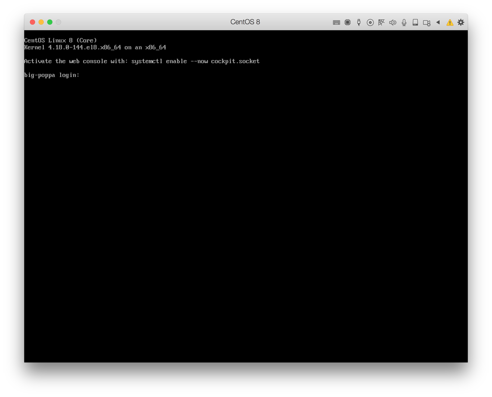
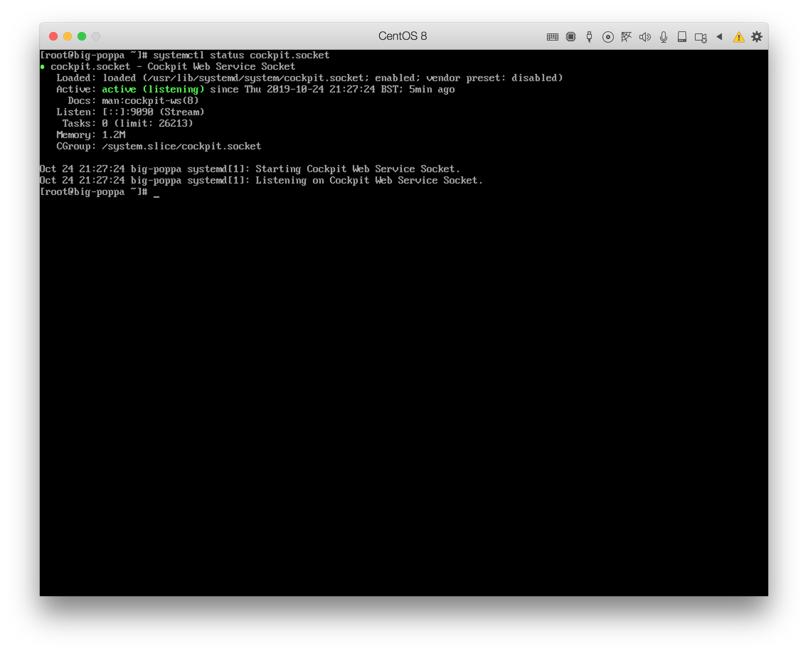
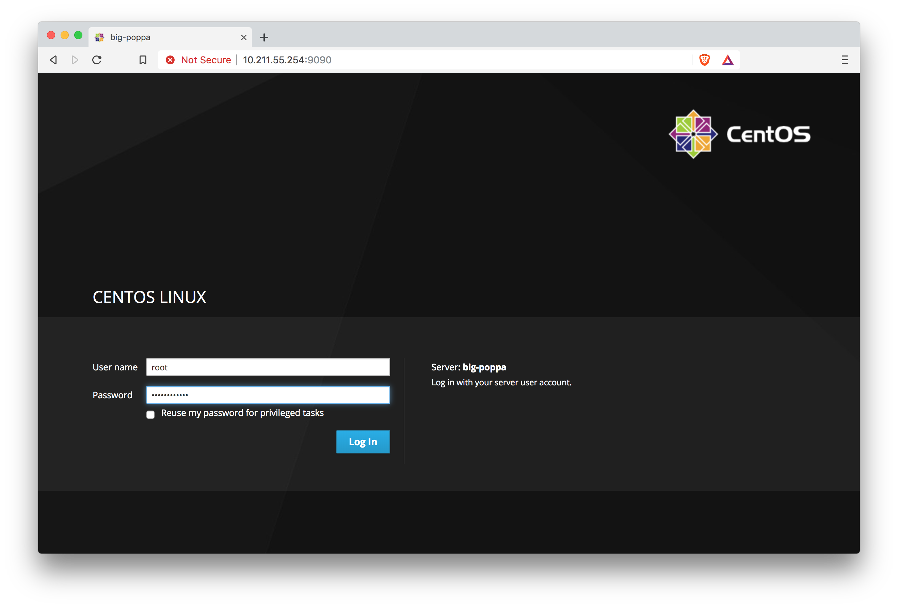
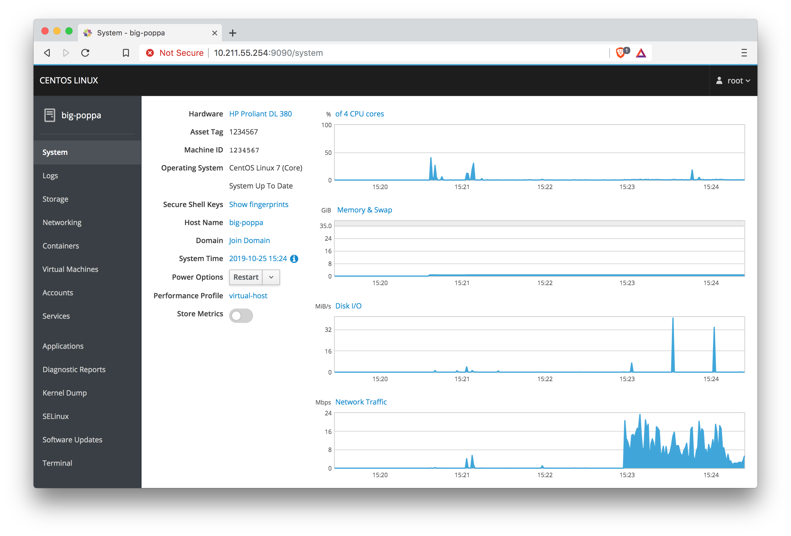
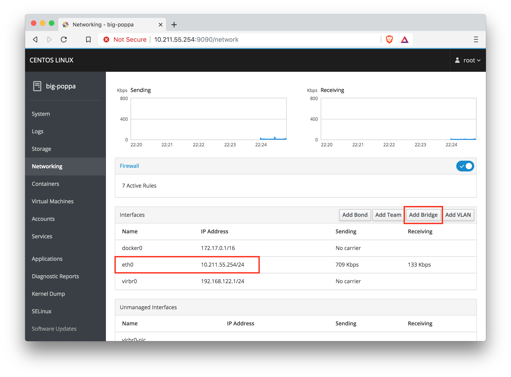
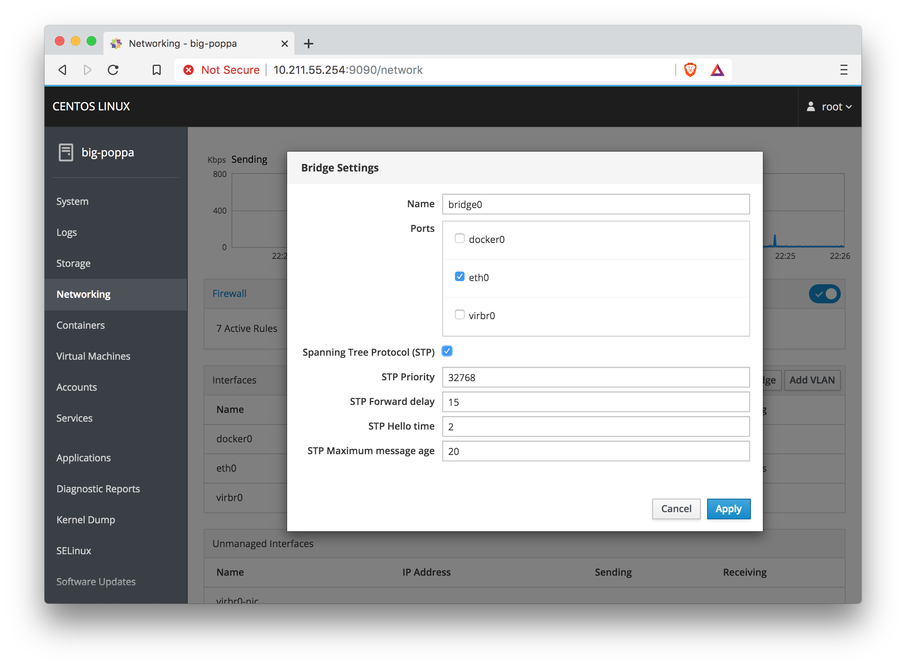
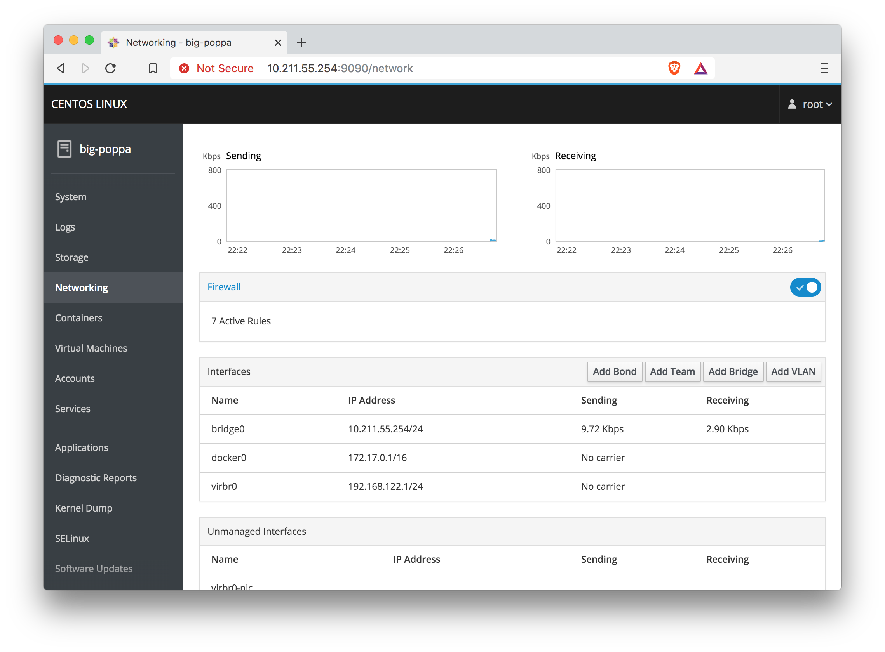

For the tinkerers and hobbyists interested in tech out there, there's often a limit to what you can test and experiment with on just a single computer at home. You may be limited by your operating system, or not want to potentially brick a computer you have your personal data on, or even need to test some network tool which requires a server and a client (or two servers, or 10 clients).

Unfortunately, there really isn't a lot that can be done with an old laptop, or underpowered desktop from a decade ago (although these are perfect candidates for a [Pi-Hole](https://pi-hole.net/)), but there is a lot you can do with a more powerful computer or server which can be picked up for [under £100 online](https://www.ebay.co.uk/sch/i.html?_from=R40&_nkw=server&_sacat=0&Number%2520of%2520Processors=2&rt=nc&_oaa=1&_dcat=11211). The rest of this post will assume the following as minimum specs for the host machine which we'll be using for our lab:

| Hardware | Minimum | Suggested |
|----------|---------|-----------|
| RAM | 32GB DDR3 | >64GB DDR3/DDR4 (ideally ECC) |
| Storage | 500GB HDD | >1TB RAID5/RAID10 HDD |
| CPU Cores | 4 @ 2GHz+ | >8 @ 2GHz+ |
| Network Interface | 1 x 1GbE | >4 x 1GbE |
| I/O Ports | 2 x USB2 | >2 x USB3.0 |

Graphics are not so much of a concern since this may be a server rather than an old gaming machine, but you should have at least a VGA port so you can see what you're doing while running through the initial install.

Once you've confirmed your machine meets or exceeds the specs above (you can try it with lower-specc'd machines too, the performance just won't be as good), you can move onto the meat and potatoes of this post.

## Outline

What this guide aims to do is run through the initial installation of CentOS 7 (minimal) on your machine, configuring it as a virtualisation platform, installing helper tools to make managing VM's and containers easier.

## Why CentOS?

This is largely a matter of personal preference, but I've opted for CentOS 7 here as the VM and `docker` host for several reasons:

Firstly, KVM is a kernel-level hypervisor - so it's essentially type-1 - meaning we're not losing out on any performance in translation from the guest to the host OS, and "CentOS minimal" as the name implies has a fairly small footprint when it comes to hardware resources.

What's more, CentOS 7 is stable, still actively maintained ([and will be until late 2024](https://en.wikipedia.org/wiki/Red_Hat_Enterprise_Linux#Product_life_cycle)) so it'll receive new security patches and updates, and will run on pracitcally anything without the need to manually install additional drivers/firmware.

Compare that to other type-1 hypervisors like VMware's ESXi (vSphere) and Microsoft's Hyper-V, where hardware support and updates can be flakey and hard to find, and a CentOS KVM host becomes a clear candidate for a DIY lab cobbled together from old or refurbished equipment on a shoestring budget.

Add to that native `docker` support, and a beautiful web console, and you've got an easily manageable one-stop-shop for a basic homelab that's quick to set up and vastly extensible.

([ProxMox](https://www.proxmox.com/en/) gets an honorable mention as it's essentially similar, but I've found CentOS and `cockpit` to be better in general as you can dive into the nuts and bolts more easily if needed.)

## Step 0: Burning the Installer

You'll need a copy of CentOS 7 Minimal before starting, which you can get from here:

<https://wiki.centos.org/Download>

The image will then need to be burnt to either a USB or DVD so you can boot to it on your server. This can be done using:

* Windows - <https://rufus.ie>
* MacOS/Linux - <https://www.balena.io/etcher>

Once that's done we can move onto the install.

## Step 1: The Install

First up, we need to boot into the newly created installer. If it's a completely new (or newly refurbished) machine with no bootable OS installed, the machine should boot to your installer when connected as soon as it's finished its POST. If this doesn't happen, or there's an OS already installed which we're removing, you'll need to get into the boot menu.

Frustratingly, how this works is not standardised, and the timeout for the instructions on getting in can be short to nil, so it's usually best acheived by just spamming the function keys on your keyboard as soon as you power the machine on, and then waiting to see what comes up on screen. Often, you'll be sent into the BIOS, but from here you can usually navigate to a boot-order menu, and then move USB (or DVD) to the top, then save and exit.

If you're really struggling, you can google the make and model of your machine with the phrase "boot menu" at the end and you'll usually find a guide online.

You'll know when you've booted into the installer when you see a screen like this:



From here you can either manually select "Install CentOS" or just leave it alone and it'll test the installer for defects and then boot to the installer when it's done.

### Configuring the Install

We'll start off by setting the hostname and IP address of the server. This can be whatever you want, but make sure the IP address isn't already taken by a machine on your network (if you're on a 192.168.X.X network, 192.168.X.254 is usually a safe bet).

The following video runs through a basic configuration of a virtualisation host:

<p>
<video src="./centOS-build.mp4" controls width="100%" type="video/mp4">
</p>

## Step 2: Configure `cockpit`

Once the installation is complete, you'll be prompted to reboot and when that's finished you should be greeted by this:



As you can see from the note above the login prompt, CentOS 8 comes with `cockpit` pre-installed. If you're using CentOS 7 or earlier, you can install `cockpit` manually.

Now we can login as `root`, using the password we set during the installation.

We can now activate `cockpit` and the modules which will be useful for our homelab:

```bash
yum update -y ## Always a good idea to run initially to get the latest patches
yum install -y cockpit \
    cockpit-docker \
    cockpit-pcp \
    cockpit-storaged \
    cockpit-machines \
    cockpit-packagekit \
    qemu-kvm-tools \
    qemu-kvm \
    libvirt \
    libvirt-python \
    libguestfs-tools \
    virt-install \
    setroubleshoot-server \
    net-tools
systemctl enable --now cockpit.socket
systemctl enable --now docker
systemctl enable --now libvirtd
firewall-cmd --add-service=cockpit --permanent
firewall-cmd --reload
systemctl status cockpit.socket
```

You should now see something like this:



You can now open a browser on another computer on the network and navigate to the IP address you set during installation in a web browser. I used `10.211.55.254` and the port is `9090` so the address for this would look like:

`https://10.211.55.254:9090/`

Just ignore the certificate warning, this is because the system generates one during the install and it's not known to our other machine. Once you're past that you'll be greeted by a login screen for the `cockpit` web service - which you can access using your `root` credentials created during the install.



## Step 3: Host Configuration

We should now be here:



From here we'll open the Terminal menu which will give us a root shell on the box, which we can use to configure the host to optimise it for hosting VM's.

For starters, we'll make sure that `/etc/sysctl.conf` is configured to allowing network traffic from our VM's on the hosts network:

```bash
vi /etc/sysctl.conf
```

Make sure that the following lines are present (and enter them if they are not):

_**Note:** If you're not familiar with `vi` here's a nice [guide on basic usage](https://www.howtogeek.com/102468/a-beginners-guide-to-editing-text-files-with-vi/)_

```conf
net.bridge.bridge-nf-call-ip6tables = 0
net.bridge.bridge-nf-call-iptables = 0
net.bridge.bridge-nf-call-arptables = 0
```

Save and quit, and then enter:

```bash
sysctl -p
```

Which should output those same lines we entered in `/etc/sysctl.conf`, meaning they've been applied.

Now we can setup our network bridge. The easiest way to do this is through the cockpit GUI, so we'll start by heading to the Networking menu, and making a note of the current active interface (highlighted below), and then click "Add Bridge" (also highlighed).



You should then see a menu with a list of interfaces to add to the bridge along with the option to enable spanning-tree protocol. Here we want to select our currently active interface, along with enabling spanning-tree protocol:



After hitting "Apply" you'll need to wait a few seconds for the new interface to come online, and then when you refresh the browser window you should see the new `bridge0` interface where the original interface was, with the same IP and network config:



## Step 4: Tinker!

We're now in a place where you're basic homelab is set up and ready to rock. If you're happy to just play with it then you're all set. If you'd like to run through a couple of simple tasks to get you started, the next article will go through setting up a `pihole` DNS and DHCP server for network-wide ad-blocking, and an Ubuntu VM you can use as a template for future builds.
